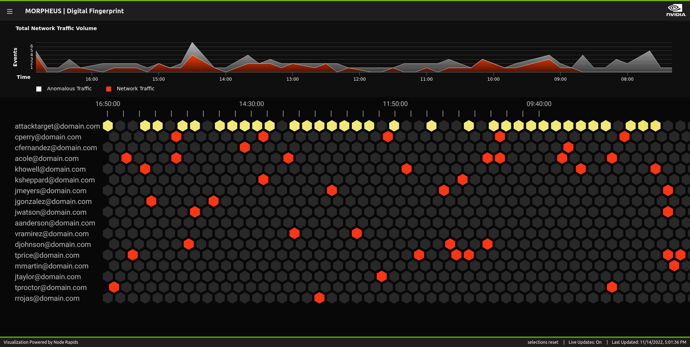
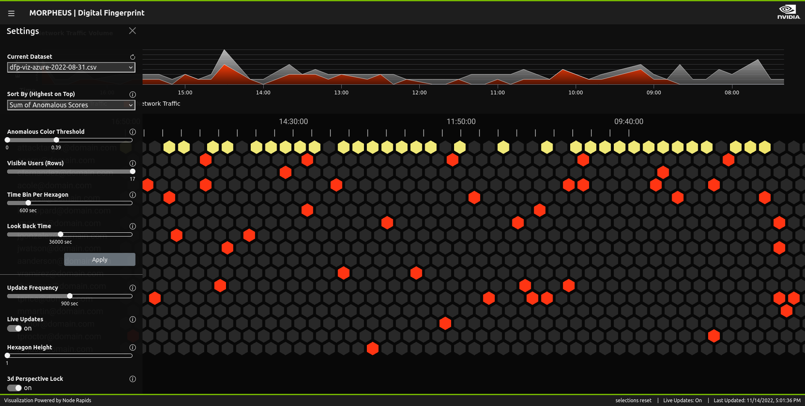
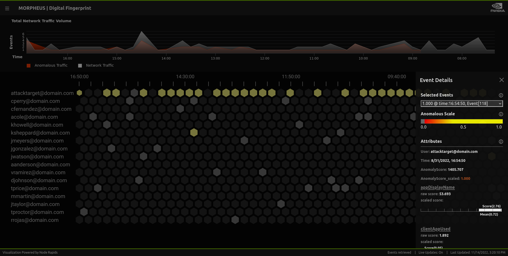

# Morpheus Digital Finger Print Visualization Tool

Visualize user access events and detect anomalies based on the anomaly score, while also tracking down anomalous patterns amongst all users.



## Getting Started

First, install the dependencies:

```bash
yarn
```

Then, run the development/production server:

```bash
# Development server
npm run dev
# or
yarn dev

# Production server
npm run build
npm run start
# or
yarn build
yarn start
```

Open [http://localhost:3000](http://localhost:3000) with your browser to see the result.

## Application Screenshots

> Configuration Panel
> 

> Event onClick info panel
> 

## Deployment

The easiest way to deploy your Next.js app is to use the [Vercel Platform](https://vercel.com/new?utm_medium=default-template&filter=next.js&utm_source=create-next-app&utm_campaign=create-next-app-readme) from the creators of Next.js.

Check out our [Next.js deployment documentation](https://nextjs.org/docs/deployment) for more details.
